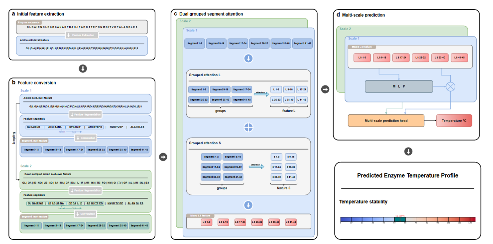

# Modeling enzyme temperature stability from sequence segment perspective



**Segment transformer** is a deep learning model designed to predict enzyme temperature stability.

---

## 🔧 Setup

### 1. Install dependencies
```bash
pip install -r requirements.txt
 ```

### 2. Download ESM-2 Weights
- Download [ESM-2 weights](https://huggingface.co/facebook/esm2_t30_150M_UR50D).
- Place the downloaded files in the `esm150/` folder.

### 3. Download Model Weights
- Download [Segment transformer weight](https://doi.org/10.5281/zenodo.15851719)
- Unzip the downloaded file and place the contents in the `output/` folder.

---

## 🚀 Inference

To run inference on your own fasta file:

predict temperature stability:
```bash
python inference.py \
--weight output/segment_transformer \
--file data/example.fasta
```

## 🏋️ Training

Train the model for each task using the appropriate config file:


```bash
python train.py \
--run_config run_configs/divide_clusters/stability.yaml \
--model_config model_configs/segment.yaml
 ```


